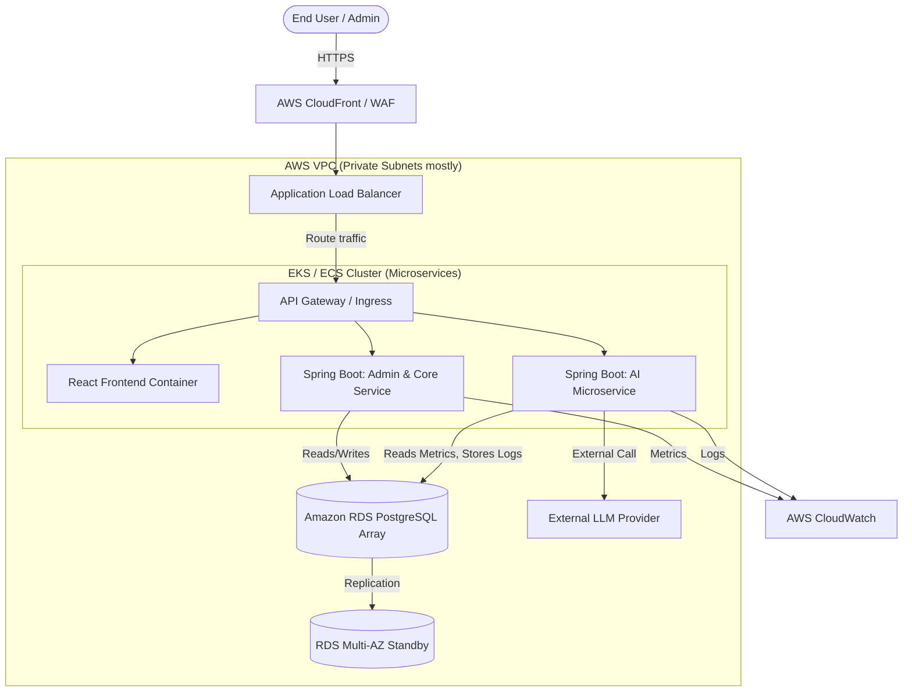

# System Architecture Diagram (Cloud Deployment Ready)

## Architecture Notes
- **Frontend**: Served via S3+CloudFront or inside a stateless ECS/EKS container.
- **Backend Layers**: Implemented in Spring Boot layered structure (Controller -> Service -> Repository).
- **Security**: JWT tokens verified at the API Gateway or individual microservices.
- **Database**: PostgreSQL handles structured, relational data (UUIDs, JSONB for AI logs).
- **Scalability**: ECS/EKS allows scaling the backend pods up and down horizontally.
